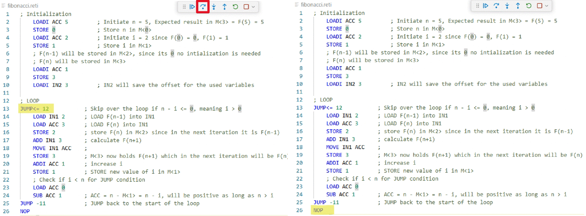

# Language Server
This extension incorporates a language server that provides several functionalities for the reti language.
## Syntax Highlighting
The extension provides syntax highlighting differentiating colors for instructions, registers, numbers and comments depending on the chosen color theme.

## Errors and warnings
When editing a reti file the extension provides diagnostics in form or errors and warnings.
Warnings are shown in yellow...

... and errors in red.

Errors highlight mistakes that will cause the code to be unable to compile and warnings highlight code that might lead to unexpected behaviours.
## Tooltips
When hovering over valid instructions or registers the language server provides tooltips that can be shown by the IDE. 

These tooltips will explain the instruction and it's effect and also give usage advice.
# Emulator
When a valid .reti or .retias file is open the emulator can be called by either pressing the key combination **ctrl+alt+e** or by clicking the arrow besides the debug symbol in the editors menu bar and selecting "Emulate".

When the emulation is running it can be stopped by clicking the according button in the editor menu bar.

# Disassembler
When a .reti file is opened the disassembler can be called by its keybinding **ctrl+alt+a** or by clicking the related symbol in the editor menu bar.
The keybinding for assembler and disassembler is the same and the difference depends on the opened file type.

The output of the disassembler is a formatted temporary file with the hexadecimal values relating to the instructions. The original instruction is written as a comment besides the hexvalue.

# Assembler
When a .retias file is opened the assembler can be called by its keybinding **ctrl+alt+a** or by clicking the related symbol in the editor menu bar.
The keybinding for assembler and disassembler is the same and the difference depends on the opened file type.

The assembler will output the reti code in a formatted temporary file. For each line the original hex value is written as a comment at the end of the line.

# ReTI-Quiz
The quiz can be called by pressing **ctrl+shift+p** and entering the command "Start ReTI Quiz" or by searching for the command and selecting it.

The quiz provides a reload button to restart the quiz and to dropdown menus to determine the number of questions in the quiz as well as the size of the immediate value that will be generated for the random instructions. [1]

The quiz is structured as a "fill in the gap" quiz. To answer click on the missing part of the hexadecimal number and fill in the right character. [2] After filling in press the check button to evaluate the answer. The result will be shown in the column to the right of the gapped hex number. [3]
Clicking the check button also reveals the correct answer in form of a second table appearing below the first [4] that contains an explanation for each bit and corresponding hex character.

# Debugger

The debugger can be called by pressing on the arrow besides the emulate button. By default the debugger will always pause before executing the first line.

## Breakpoints  

The extension allows setting breakpoints, functioning like those in most standard debuggers. Execution will continue until a breakpoint is hit, at which point it will pause on that line. All execution controls, including *Continue*, *Step Out*, and *Step Over*, will stop at breakpoints.

## Continue  
Execution can be resumed by clicking the *Continue* button, as shown in the image. The program will then run until either the end or the next breakpoint is reached.

While running, the set of control buttons changes to include a *Pause* button, which can be used to halt execution at any time.

## Step Over  

ReTI does not support function calls so for the functionality of the *Step-Over*-button we chose to interpret this action as skipping a Loop.

If the program counter (PC) is at a jump instruction, *Step Over* will continue execution until the instruction of the target PC of said jump is reached. Note that this behavior may vary depending on the program—execution and may continue until the end if the target instruction is not reached.

In the example below a `JUMP` is encountered in line 13 corresponding to PC 7. The target PC is calculated *(7+12=19)*, this corresponds to line 26. After pressing the *Step-Over*-button execution continues until reaching line 26.

## Step In  

*Step In* executes the next instruction unconditionally. It acts as a simple single-step operation.

## Step Out

Since ReTI does not support actual call backs, a custom interpretation for the *Step Out* functinality was chosen that allows the user to exit the current loop. To this end the target-pc of each encountered `JUMP` is saved in a list that functions as the call stack. *Step Out* will then execute until the last item of the stack is reached. If the stack is empty *Step Out* will behave like *Continue*.

See below for an example of this behaviour.

In this example the current PC of line 13 is 7. With *Step In* a single exection is performed. Since the call-stack is empty *Step Out* would run until the end of the program is reached.

Now that the `JUMP` instruction is passed the target PC **(12+7=19)** is saved to the call stack. PC 19 corresponds to line 26 in the code.

Now inside of the loop when pressing the *Step-Out*-button  execution will continue until being halted in line 26 when PC 19 is reached.

Upon reaching the target-pc it is removed from the call stack leaving it empty.

## Read and Set Registers  
Registers are displayed like variables and can be edited directly in the same interface. Simply modify the value of any register as needed.

By pressing on the register you can edit the value stored in it to any decimal number.

## Watch Memory  
Memory can be monitored by adding the desired memory address to the watch list, similar to adding a variable. This allows you to track changes to specific memory cells during execution.

Press add expression in the variables tab.

On the left is the address as a decimal number and on the right the value stored in it.
