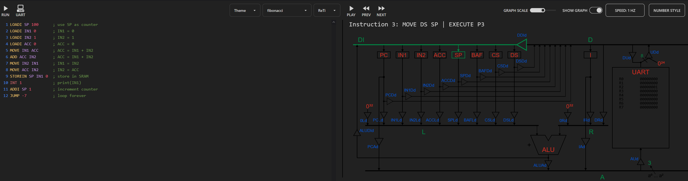

# reti-tools README
ReTI is a simple computer architecture, based on the Rechner Saarbrücken, which is used to teach the low level working of machines to students at the University of Freiburg.
For the course of "Technische Informatik" at the University of Freiburg Prof. Dr. Armin Biere as already developed a collection of tools [(see Related Works)](#Related-Works) written in C that provide an Emulator, Assembler, Disassembler and an interactive Quiz for teaching purposes.

This extension aims to improve usability by bringing those features to the most widely used IDE, while also adding new capabilities such as debugging support, a language server, and an interactive quiz website accessible directly from within VS Code.

## Related Works
* [Pico-C to ReTI compiler](https://github.com/matthejue/PicoC-Compiler)
* [Reti-Emulator with datapahs visualization](https://github.com/michel-giehl/Reti-Emulator)
* [ReTI-code tools by Armin Biere](https://github.com/arminbiere/reticode)

## [Features](./Features.md)

## [ReTI Overview](./ReTI-Architecture.md)

## Before Running

All requirements can be installed by running `npm install`.

Afterwards compile the extension by running `npm run compile`.

The language server has to be compile seperatly by running `npm run compile-lsp`.

## Extension Settings

Include if your extension adds any VS Code settings through the `contributes.configuration` extension point.

For example:

This extension contributes the following settings:

* `myExtension.enable`: Enable/disable this extension.
* `myExtension.thing`: Set to `blah` to do something.

## Known Issues

### Room for improvement
#### Memory view
VS Code by default provides no memory view. The current workaround using the watch expression feature is fine for monitoring single cells but clunky when larger chunks of memory need to be observed.

Future improvements could incorporate another extension or implement this functionality directly.

#### Datapaths
An important topic in the course Technische Informatik is the datapaths and drivers that are activated during the execution of a ReTI program. A live visualization of these elements could be extremely valuable for students during code execution.
A similar tool has already been implemented: [Reti-Emulator with datapahs visualization](https://github.com/michel-giehl/Reti-Emulator).

An example can be seen in the image below:

#### Pico-C compiler

## Release Notes

### 1.0.0
Initial Release